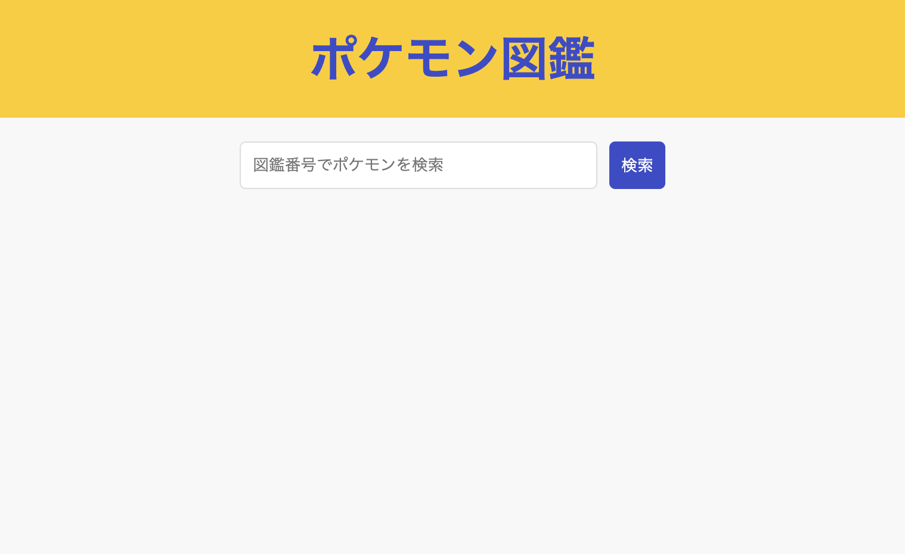

# Pokexample

## 使用技術

## プロジェクト概要

SpringBootとPokeApi（[公式サイト](https://pokeapi.co/)）を利用したポケモン図鑑サイト

ポケモンの全国図鑑番号を入力し、対応するポケモンを表示する簡単なアプリケーションです。

バリデーションチェックは行っていないので、何か要望があればIssuesの追加をお願いします。

## 開発環境の構築方法

### IDE上での実施方法

1. Java17をインストール
2. IDEをインストール
3. pokexampleをGradleプロジェクトとしてインポート（ここまででコンパイルが通るようになる）
4. `jp.co.pokexample.PokexampleApplication` にあるmainクラスをSpringBootアプリケーションとして実行
5. `http://localhost:8080/` にアクセスし、以下の画面が表示されれば成功

### Gradleコマンドでの実行

1. Java17をインストール
2. ターミナル（コマンドプロンプト）でpokexampleのディレクトリ直下に移動
3. `./gradlew build` を実行
4. `http://localhost:8080/` にアクセスし、トップ画面が表示されれば成功
